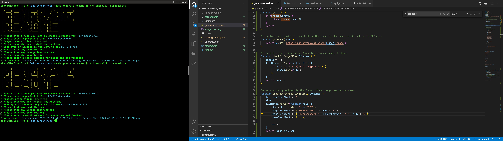
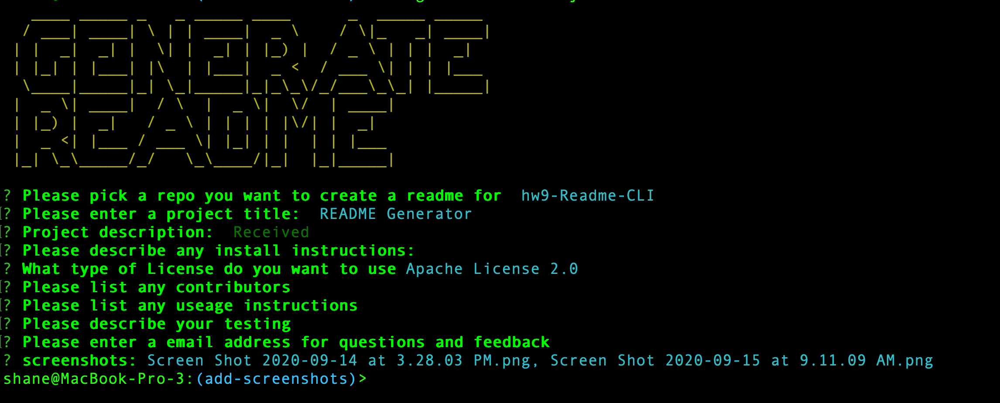

    
 
# Project name : README GENERATOR

[hw9-Readme-CLI](https://github.com/trilambda122/hw9-Readme-CLI)
---
## Table of Contents

[Description](#description)...

[Installation Requirements](#installtion-requirments)...

[Useage](#useage)...

[License](#License)...

[Contribitors](#Contribitors)...

[Tests](#Tests)...

[Questions](#Questions)...

[Application Screen Shots](#ScreenShots)...

---
## Description
 This readme file generator take a gibhub username from the CLI and will return a list of the users repos to select from.
    The optional paramater is a directory where screenshots of the applicaiton and will add the slected images to the screenshot section of the readme file. 
    It also allows the user to select from the list of supported licenses and will add a license badge to the top of the file. 
    In order to enter a lengthy description from the CLI the application will open the default text editor 

---

## Installtion requirments
npm install

---
## Useage
node generate-readme.js github-username screenshot-directory

---
## License
NOTICE This application is covered under MIT License license.
Please see license.md file for more information 

---
## Contribitors 

trilambda122

---
## Tests
random at best

---
## Questions

Github profile can be found here:  http://github.com/trilambda122

Please direct any additonal questions to: trilambda122@gmail.com

---
## ScreenShots

*SCREEN SHOT 1*
*SCREEN SHOT 2*

